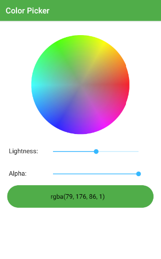
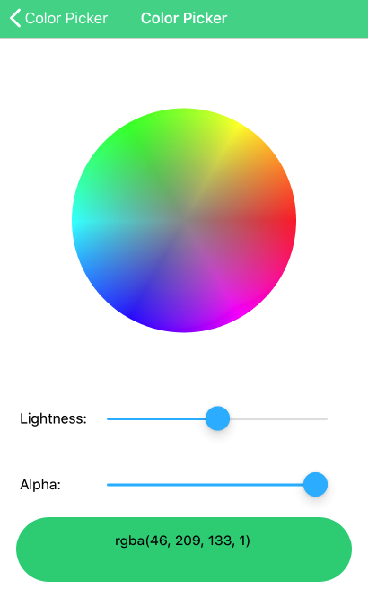

# NativeScript-Vue-Color-Picker

> A Nativescript-Vue color picker component for Android and IOS using hsl-spectrum touch selection, lightness and alpha sliders

Based on the code from [nativescript-color-picker](https://github.com/bradmartin/nativescript-color-picker)

## Screenshots

| Android                   | iOS                                        |
| -------------------------------- | ------------------------------------------------- |
|  |  |

## Usage

``` bash
# Install dependencies
npm install

# Run on Android
tns run android

# Run on IOS
tns run ios

```
